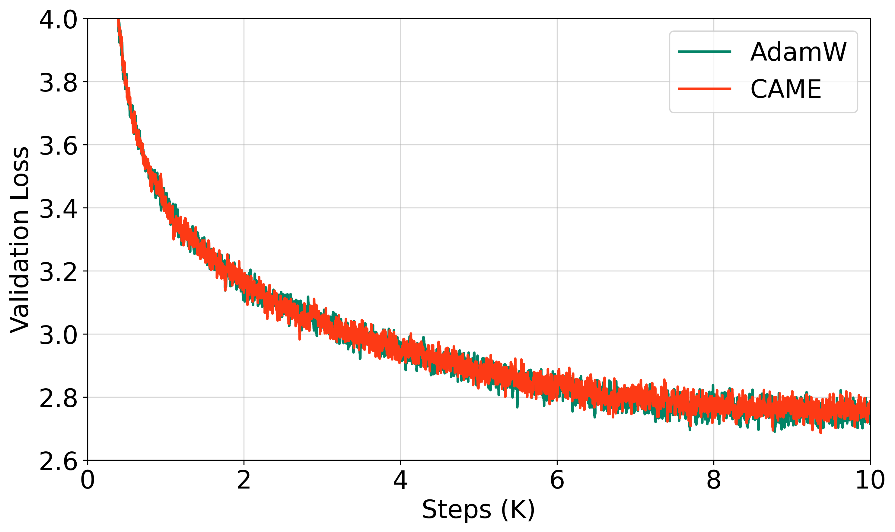

<h1 align="center">CAME Optimizer</h1>
<h3 align="center">ACL 2023 Outstanding Paper Award<br/>Confidence-guided Adaptive Memory Efficient Optimization</h3>


This is an official implementation of **CAME** optimizer in the "[Confidence-guided Adaptive Memory Efficient Optimization](https://arxiv.org/abs/2307.02047)". Please cite the paper and star this repo if you find CAME useful. Thanks!

[Paper](https://arxiv.org/abs/2307.02047) | [Twitter](https://twitter.com/ZangweiZheng/status/1680227732788236289) | [Blog](https://zhengzangw.github.io/blogs/came) | [Pypi Package](https://pypi.org/project/came-pytorch/) | [zhihu](https://zhuanlan.zhihu.com/p/643816029)
## Method

In this work, we studied a confidence-guided strategy to reduce the instability of existing memory efficient optimizers. Based on this strategy, we proposed CAME to simultaneously achieve two goals: fast convergence as in traditional adaptive methods, and low memory usage as in memory-efficient methods.

The pseudo code is presented in the figure with difference with Adafactor in blue fonts.

<p align="center">

</p>
<!--  -->

## Install 
```
pip install came-pytorch
```
## Usage

```python
from came_pytorch import CAME
optimizer = CAME(
    model.parameters(),
    lr=2e-4,
    weight_decay=1e-2,
    betas=(0.9, 0.999, 0.9999),
    eps=(1e-30, 1e-16)
)
```

## Hyper-parameter Tuning

* Pre-training: Based on our experiments on BERT-Large, GPT-2, and T5, it's suitable to choose a learning rate for CAME 0.5-0.9x lr for AdamW.
* Set $\beta_1$ and $\beta_2$ to the same values used in AdamW. Choose $\beta_3$ to be larger than $\beta_2$. For example, consider choosing $\beta_3$ between $[0.9995, 0.99995]$ if setting $\beta_1, \beta_2=0.9, 0.999$, and choosing $\beta_3$ between $[0.99, 0.999]$ if setting $\beta_1, \beta_2=0.9, 0.95$. Due to computational resource constraints, we did not explore more combinations of three betas. Different training tasks may require different combinations of optimal performance.
* If you have any feedback or comments regarding hyper-parameter tuning, please do not hesitate to provide them to us!

## Experiments

Apart from the BERT and T5 experiments shown in the paper, we conduct more and record the results here.

### Fine-tuning Llama-7B

|                |    MMLU     |  WikiText  |  HellaSwag  |  TruthfulQA (MC)  |    BoolQ    |    COPA     |     WSC     |     WIC     |
| -------------- |:-----------:|:----------:|:-----------:|:-----------------:|:-----------:|:-----------:|:-----------:|:-----------:|
| Alpaca-7B      |    40.21    |    6.74    |    59.76    |     **38.89**     |  **79.57**  |  **88.00**  |    46.15    |    49.84    |
| Alpaca-7B-CAME |  **40.59**  |  **6.38**  |  **59.80**  |       38.61       |    79.08    |  **88.00**  |  **49.04**  |  **50.78**  |

We fine-tuned Llama-7B with [stanford-alpaca](https://github.com/tatsu-lab/stanford_alpaca) (52k instruction-tuning dataset). To replicate our result, first register the CAME optimizer to the transformer package. Then in Alpaca training script, change the default optimizer from "adamw" to "came".

Alpaca-7B and Alpaca-7B-CAME are evaluated using [Instruct-eval](https://github.com/declare-lab/instruct-eval) and [lm-evaluation-harness](https://github.com/EleutherAI/lm-evaluation-harness).

### Pre-training Llama on C4

<p align="center">

</p>
<!--  -->

The pre-training of Llama-1B is based on [C-Optim](https://github.com/kyleliang919/C-Optim). The hyperparameters of CAME are configured with betas (0.9, 0.95, 0.995), and AdamW uses betas (0.9, 0.95).

### Pre-training GPT-2


The pre-training of GPT-2 (Medium, 345M) is based on [Megatron-LM](https://github.com/NVIDIA/Megatron-LM). To replicate our result, add the CAME optimizer in [`megatron/optimizer/__init__.py`](https://github.com/NVIDIA/Megatron-LM/blob/main/megatron/optimizer/__init__.py) and set the *args.optimizer* to "came".

## Memory Usage Comparison
To ensure a fair comparison, we set the batch size to 1 for the pre-training of GPT-2 (Medium) to examine the memory footprint of CAME and AdamW.

|              | AdamW | CAME     | 
|--------------|-------|----------|
| Memory (GiB) | 8.77  | **7.44** | 

## Citation

```bibtex
@inproceedings{luo2023came,
  title={CAME: Confidence-guided Adaptive Memory Efficient Optimization},
  author={Luo, Yang and Ren, Xiaozhe and Zheng, Zangwei and Jiang, Zhuo and Jiang, Xin and You, Yang},
  booktitle={Proceedings of the 61st Annual Meeting of the Association for Computational Linguistics (Volume 1: Long Papers)},
  pages={4442--4453},
  year={2023}
}
```
